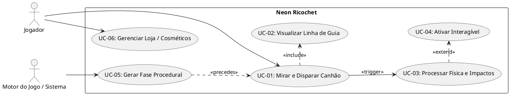
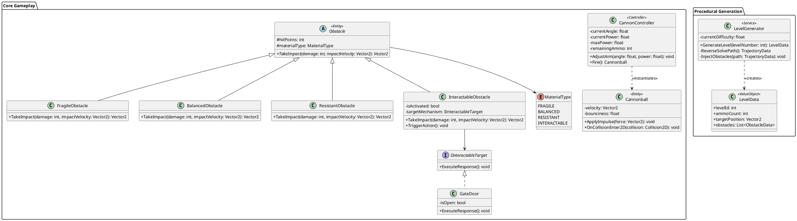
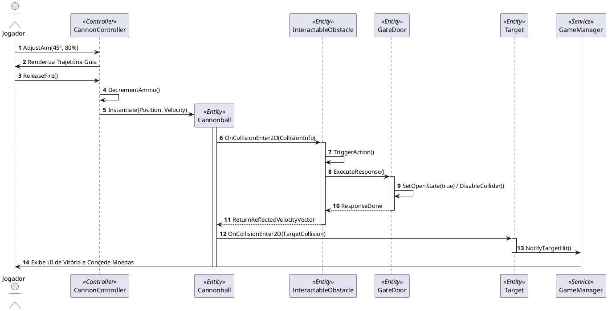
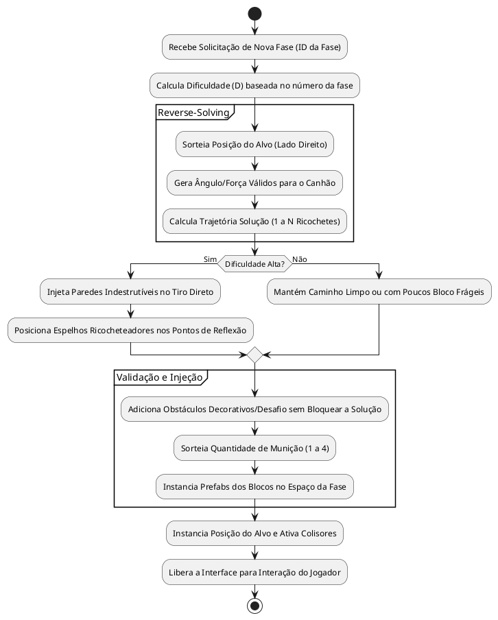
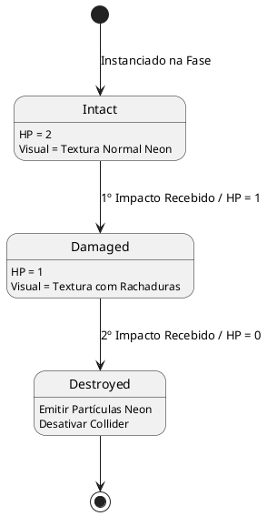

## 1. Visão Geral do Sistema

### 1.1 Nome do Jogo

**Arc-Impact**

### 1.2 Objetivo e Escopo

#### Objetivo

Desenvolver um jogo casual de puzzle e precisão 2D (*Arc-Impact*) com geração procedural infinita de fases baseadas em simulação de física, focado em alta jogabilidade e retenção através de desafios de ricochete e destruição de obstáculos em estética *Cyberpunk Neon*.

#### Escopo Incluído (In-Scope)

* **Core Gameplay:** Mecânica de mira, controle de potência de disparo, cálculo de trajetória parabólica e sistema de física 2D.
* **Sistema de Materiais:** Lógica de colisão, destruição e ricochete para 4 categorias de blocos (Frágil, Equilibrado, Resistente, Interagível).
* **Mecanismos Interagíveis:** Botões acionadores, portões retráteis e zonas de aceleração/impulso.
* **Motor Procedural:** Algoritmo de geração infinita de fases baseado na técnica de *reverse-solving* (criação da rota solução e injeção de obstáculos) com curva de dificuldade progressiva ($D$).
* **Interface & HUD:** UI minimalista responsiva para telas sensíveis ao toque (Mobile) e comandos de ponteiro/teclado (PC).
* **Metagame Cosmético:** Loja local para desbloqueio de skins de canhão, rastros de projétil (*trails*) e paletas de cores para HUD via moedas virtuais do jogo.
* **Persistência Local:** Salvamento offline de moedas, itens desbloqueados e recorde de fases alcançadas.

#### Escopo Excluído (Out-of-Scope)

* Modo multijogador em tempo real ou assíncrono.
* Suporte a compras com dinheiro real (*In-App Purchases* / IAP) no MVP.
* Editor manual de fases para usuários (*Level Maker*).
* Integração com nuvem para sincronização cross-platform (*Cloud Save*).

### 1.3 Stakeholders e Responsabilidades

| Stakeholder / Papel | Responsabilidade Principal |
| --- | --- |
| **Product Owner (PO)** | Definição do escopo, priorização de entregas e validação do fluxo do jogador. |
| **Analista de Sistemas / Game Designer** | Especificação técnica, detalhamento de requisitos e regras de negócio para geração procedural. |
| **Engenheiro de Gameplay / Física** | Implementação das mecânicas do canhão, tratamento de colisões e integrações de físicas 2D. |
| **Engenheiro de Sistemas / Algoritmos** | Desenvolvimento do motor de geração procedural de fases e sistema de regras de *reverse-solving*. |
| **Artista UI/UX & FX** | Criação dos assets em estética Neon/Cyberpunk, partículas, paletas de cores e fluxo de interface. |
| **Agente de Vibe Coding (LLM / Copilot)** | Consumo dos prompts estruturados para geração de módulos de código limpo e desacoplado. |

### 1.4 Premissas e Restrições

#### Premissas

* A simulação física será determinística ou padronizada para garantir que o *reverse-solving* de cada fase seja resolvível.
* O motor do jogo dará suporte às plataformas Mobile (Android/iOS) e PC (Web/Steam) mantendo uniformidade na resolução de física.

#### Restrições

* **Taxa de Quadros:** Execução contínua a 60 FPS em dispositivos mobile intermediários.
* **Armazenamento:** Tamanho final do executável não deve ultrapassar 150 MB no mobile.
* **Tempo de Carregamento:** O tempo de geração procedural entre fases deve ser inferior a 300 ms.

---

## 2. Requisitos Funcionais (RF)

| ID | Descrição | Ator | Prioridade | Critérios de Aceitação (Given-When-Then) | Regras associadas |
| --- | --- | --- | --- | --- | --- |
| **RF-001** | Ajustar ângulo e potência de disparo do canhão. | Jogador | Must | **Given** que o jogador está na tela de jogo,<br>

<br>**When** ele arrasta/segura o controle de mira,<br>

<br>**Then** a orientação do canhão e o medidor de força devem atualizar visualmente em tempo real. | RN-01 |
| **RF-002** | Visualizar guia de trajetória inicial. | Jogador | Must | **Given** que o jogador ajustou o ângulo e a força,<br>

<br>**When** ele mantém o toque/clique acionado,<br>

<br>**Then** o sistema exibe a linha pontilhada da trajetória parabólica limitada aos primeiros metros do disparo. | RN-01, RN-02 |
| **RF-003** | Efetuar disparo do projétil. | Jogador | Must | **Given** que o jogador possui pelo menos 1 tiro disponível e a ação de mira é solta,<br>

<br>**When** o disparo é executado,<br>

<br>**Then** o projétil é instanciado, adicionado à simulação física e o contador de tiros decrementa em 1. | RN-02, RN-03 |
| **RF-004** | Processar colisões com obstáculos. | Sistema | Must | **Given** que o projétil atinge um bloco,<br>

<br>**When** o impacto ocorre,<br>

<br>**Then** o sistema deve aplicar o comportamento correspondente ao tipo de material (Frágil, Equilibrado, Resistente, Interagível). | RN-04, RN-05 |
| **RF-005** | Validar condição de vitória. | Sistema | Must | **Given** que o projétil colide com a área do alvo,<br>

<br>**When** a colisão é registrada,<br>

<br>**Then** a fase é encerrada com status de Vitória, o jogador recebe moedas e o botão de próxima fase é liberado. | RN-03, RN-07 |
| **RF-006** | Validar condição de derrota. | Sistema | Must | **Given** que a contagem de tiros chega a zero,<br>

<br>**When** todos os projéteis disparados cessarem movimento sem atingir o alvo,<br>

<br>**Then** o sistema declara a fase como Derrota e exibe a opção de reiniciar. | RN-03 |
| **RF-007** | Gerar fase proceduralmente. | Sistema | Must | **Given** a solicitação de uma nova fase (ID da fase $N$),<br>

<br>**When** a fase é inicializada,<br>

<br>**Then** o sistema sorteia a munição, posiciona o alvo, valida uma rota matematicamente vitoriosa e injeta obstáculos no cenário. | RN-06 |
| **RF-008** | Interagir com gatilhos de cenário. | Sistema | Must | **Given** que um projétil atinge um material Interagível (ex: botão),<br>

<br>**When** o impacto ocorre,<br>

<br>**Then** o elemento vinculado (ex: portão) altera seu estado mantendo o evento em log. | RN-05 |
| **RF-009** | Coletar moedas virtuais. | Jogador | Should | **Given** a conclusão bem-sucedida de uma fase,<br>

<br>**When** a tela de Vitória é exibida,<br>

<br>**Then** o saldo do jogador é atualizado com o valor obtido pela performance da fase. | RN-07 |
| **RF-010** | Personalizar e equipar itens cosméticos. | Jogador | Could | **Given** que o jogador possui moedas suficientes na loja,<br>

<br>**When** ele adquire e clica em equipar em um item (skin, trail ou tema),<br>

<br>**Then** o item torna-se o ativo padrão nas partidas seguintes. | RN-08 |

---

## 3. Requisitos Não Funcionais (RNF)

| ID | Categoria | Descrição | Justificativa | Critério de Verificação |
| --- | --- | --- | --- | --- |
| **RNF-001** | Performance | O jogo deve manter a taxa de atualização em 60 FPS contínuos durante o disparo de projéteis e destruição de blocos em múltiplos pedaços. | Garantir a fluidez e precisão da resposta tátil/visual exigida por jogos de física arcade. | Teste de profiling em dispositivo Android intermediário com medição via contador de frames. |
| **RNF-002** | Usabilidade | A interface deve se adaptar automaticamente tanto a telas orientadas na na horizontal quanto a diferentes resoluções mobile/desktop (aspect ratios 16:9, 19.5:9, 16:10). | Garantir usabilidade consistente na expansão mobile e PC. | Testes automatizados em emuladores com variação de viewport. |
| **RNF-003** | Manutenibilidade | A arquitetura da aplicação deve seguir estritamente o padrão decoupled/componentizado (ex: desacoplamento via Event-Driven Architecture / ScriptableObjects). | Facilitar o consumo por ferramentas de *vibe coding* e adição de novos materiais/mecanismos. | Análise estática de código e checagem de acoplamento de classes. |
| **RNF-004** | Escalabilidade | O gerador procedural deve executar e validar o tabuleiro da fase dentro de um tempo limite de no máximo 300 ms por nível. | Evitar telas de carregamento perceptíveis entre fases para o jogador. | Benchmark da função `GenerateLevel()` executado $1.000$ vezes com medição de tempo de CPU. |
| **RNF-005** | Segurança / Integridade | As informações de moedas salvas, recordes e itens desbloqueados devem ser persistidas com codificação e checksum contra adulteração local simples. | Impedir modificação trivial de valores salvos no arquivo local (`PlayerPrefs`/`JSON`). | Validação da integridade ao tentar alterar manualmente o arquivo de *save* salvo em disco. |

---

## 4. Glossário e Regras de Negócio

### 4.1 Glossário

* **Arc-Impact:** Subgênero de jogos focado em disparos de projéteis com arcos parabólicos e colisão com alvos/estruturas.
* **Trail:** Efeito visual de rastro luminoso anexado à trajetória do projétil durante o voo.
* **Reverse-Solving:** Técnica de geração procedural que desenha a solução (caminho seguro/vitorioso) primeiro para posteriormente posicionar os desafios e obstáculos ao redor do caminho.
* **Ângulo de Incidência:** O ângulo formado pela trajetória do projétil ao atingir a superfície plana de um bloco, utilizado no cálculo do vetor de ricochete.

### 4.2 Regras de Negócio (RN)

* **RN-01 (Limites do Canhão):** O ângulo de disparo do canhão é estritamente limitado no intervalo $[0^\circ, 90^\circ]$. A força de disparo é mapeada entre $10\%$ e $100\%$ do valor máximo de impulso $F_{max}$.
* **RN-02 (Linha de Trajetória):** A pré-visualização do arco deve mostrar exatamente $20\%$ da trajetória total calculada com base na força atual, sem revelar o caminho final com ricochetes.
* **RN-03 (Alocação de Munição):** A quantidade de munições por fase é definida aleatoriamente na geração procedural, limitada entre $1$ e $4$ projéteis por partida.
* **RN-04 (Mecanismo dos Materiais):**
* *Frágil (1 HP):* Destruído no 1º impacto. O projétil reduz sua velocidade linear em $15\%$ e mantém seu vetor de movimento original.
* *Equilibrado (2 HP):* 1º impacto insere textura de rachadura e mantém integridade física (com reflexão parcial do movimento); 2º impacto destrói o bloco.
* *Resistente ($\infty$ HP):* Indestrutível. O projétil ricocheteia aplicando a lei da reflexão ($\theta_{incidência} = \theta_{reflexão}$) com atenuação de $5\%$ na velocidade por atrito/absorção.


* **RN-05 (Comportamento dos Interagíveis):**
* *Botão:* Ao colidir com um projétil, transita seu estado interno de `Inativo` para `Ativado`. Envia evento ao sistema sem consumir a energia física do projétil.
* *Portão:* Associado a um ou mais Botões. Quando os botões vinculados são ativados, o portão executa transição de animação para desativar sua caixa de colisão (*hitbox*).
* *Campo de Levitação:* Zona delimitada por gatilho invisível (*trigger*). Ao entrar na área, aplica uma aceleração vetorial adicional ao projétil na direção definida no campo.


* **RN-06 (Regra de Dificuldade Procedural - $D$):**
* Fases $1$ a $10$ ($D_{baixa}$): Posição do alvo direta. Solução com $0$ ricochetes necessários. Máximo de $2$ blocos frágeis na linha de visada.
* Fases $11+$ ($D_{alta}$): Bloqueio total da rota direta com paredes indestrutíveis. Exigência mínima de $1$ a $3$ ricochetes para atingir o alvo.


* **RN-07 (Recompensa de Moedas):** A recompensa de uma fase concluída é dada pela equação $M = 100 + (T_{restantes} \times 50)$, onde $T_{restantes}$ é o número de disparos não utilizados na partida.
* **RN-08 (Invariante de Customização):** Alterações cosméticas (skins, trails, temas de UI) aplicam-se estritamente à camada de apresentação visual (`View`), sem alterar a caixa de colisão, massa, velocidade ou gravidade das entidades do jogo.

---

## 5. Modelagem UML

### 5.1 Diagrama de Casos de Uso



#### Descrição Estruturada do Caso de Uso Crítico: UC-01 (Mirar e Disparar Canhão)

* **Ator Principal:** Jogador.
* **Pré-condições:** O nível foi gerado proceduralmente e possui pelo menos 1 munição disponível.
* **Fluxo Principal:**
1. O jogador toca/clica na tela na área de controle do canhão.
2. O jogador arrasta alterando o vetor de mira. O sistema exibe visualmente a inclinação do canhão e a linha guia de trajetória (UC-02).
3. O jogador solta o controle para confirmar o disparo.
4. O sistema consome 1 unidade da munição disponível.
5. O sistema instancia o projétil aplicando o vetor de força calculado.
6. O fluxo passa para o processamento de física (UC-03).


* **Fluxo Alternativo (A1 - Cancelar Disparo):**
1. O jogador arrasta a mira de volta para a posição inicial de repouso (força $< 5\%$).
2. O jogador solta a tela sem acionar o disparo. O canhão retorna ao estado neutro sem gastar munição.


* **Fluxo de Exceção (E1 - Munição Esgotada):**
1. A munição do nível chega a $0$ e a simulação de projéteis em campo se encerra sem atingir o alvo.
2. O sistema bloqueia a ação de disparar e dispara o evento de Derrota.


* **Pós-condições:** Munição decrementada e projétil ativo na cena.

---

### 5.2 Diagrama de Classes



---

### 5.3 Diagrama de Sequência (Fluxo de Disparo e Impacto com Obstáculo)



---

### 5.4 Diagrama de Atividades (Geração Procedural por Reverse-Solving)



---

### 5.5 Diagrama de Estados (Ciclo de Vida do Obstáculo Equilibrado)



---

## 6. Especificação Técnica para Vibe Coding

Este entregável foi otimizado para consumo e geração automática de código em ferramentas de *vibe coding* (ex: Cursor, Windsurf, Copilot, Claude Code).

### 6.1 Descrição Técnica Detalhada

* **Arquitetura Recomendada:** Arquitetura Orientada a Eventos baseada em Componentes (*Component-Driven Architecture*), mantendo total separação entre lógica de física (`Domain`), renderização visual (`View`) e orquestração de jogo (`Controller`).
* **Stack Tecnológica Sugerida:**
* **Engine/Runtime:** Unity (C#) ou Godot 4 (C# / GDScript) ou HTML5 Canvas / PixiJS + Matter.js (para versão Web).
* **Engine de Física:** Box2D ou Physics2D integrado da Engine.
* **Armazenamento:** JSON encriptado localmente via AES-128.


* **Padrões de Design Obrigatórios:**
* **Repository Pattern:** Para gestão e escrita de dados de moedas e cosméticos adquiridos.
* **Factory Pattern:** Para criação procedural de blocos e instaciação de projéteis.
* **Observer Pattern:** Para comunicação desacoplada de eventos do jogo (`OnTargetHit`, `OnAmmoChanged`, `OnObstacleDestroyed`).
* **Strategy Pattern:** Para os comportamentos e respostas de cada tipo de `MaterialType`.


---

### 6.2 Especificação de API/Endpoints (Serviço Local ou API Web Intermediária)

Como o MVP é offline-first, a estrutura abaixo especifica o contrato da API Interna de Serviços (`Local Game Services API`), pronta para futura adaptação REST em servidor.

#### Endpoint 1: Gerar Estrutura de Fase

* **Método:** `GET`
* **Rota:** `/api/v1/level/generate`
* **Query Parameters:**
* `levelNumber` (int, obrigatório, $\ge 1$)
* `seed` (int, opcional - se omitido, sorteia um aleatório)


##### Request Body (N/A)

##### Response Body (200 OK)

```json
{
  "status": "success",
  "data": {
    "levelId": 42,
    "seed": 892301,
    "ammoCount": 3,
    "target": {
      "position": { "x": 8.5, "y": 1.2 }
    },
    "obstacles": [
      {
        "id": "obs_01",
        "type": "FRAGILE",
        "position": { "x": 4.0, "y": 2.0 },
        "rotation": 0.0,
        "scale": { "x": 1.0, "y": 1.0 }
      },
      {
        "id": "obs_02",
        "type": "INTERACTABLE",
        "position": { "x": 2.5, "y": -1.0 },
        "rotation": 45.0,
        "scale": { "x": 1.0, "y": 1.0 },
        "actionTargetId": "gate_01"
      },
      {
        "id": "gate_01",
        "type": "GATE",
        "position": { "x": 6.0, "y": 1.2 },
        "rotation": 90.0,
        "scale": { "x": 0.5, "y": 2.0 }
      }
    ]
  }
}

```

##### Response Body Error (400 Bad Request)

```json
{
  "status": "error",
  "errorCode": "INVALID_LEVEL_NUMBER",
  "message": "O número da fase deve ser um inteiro positivo maior ou igual a 1."
}

```

---

#### Endpoint 2: Validar e Finalizar Fase

* **Método:** `POST`
* **Rota:** `/api/v1/level/complete`

##### Request Body

```json
{
  "levelId": 42,
  "remainingAmmo": 2,
  "targetHit": true,
  "executionTimeSeconds": 14.5
}

```

##### Response Body (200 OK)

```json
{
  "status": "success",
  "data": {
    "rewardCoins": 200,
    "newTotalCoins": 1450,
    "nextLevelId": 43
  }
}

```

---

### 6.3 Modelo de Dados

#### Esquema de Persistência Local (JSON Schema)

```json
{
  "$schema": "http://json-schema.org/draft-07/schema#",
  "title": "PlayerSaveData",
  "type": "object",
  "properties": {
    "playerId": { "type": "string", "format": "uuid" },
    "highestLevelReached": { "type": "integer", "minimum": 1 },
    "coins": { "type": "integer", "minimum": 0 },
    "inventory": {
      "type": "object",
      "properties": {
        "equippedSkin": { "type": "string" },
        "equippedTrail": { "type": "string" },
        "equippedTheme": { "type": "string" },
        "unlockedSkins": { "type": "array", "items": { "type": "string" } },
        "unlockedTrails": { "type": "array", "items": { "type": "string" } },
        "unlockedThemes": { "type": "array", "items": { "type": "string" } }
      },
      "required": ["equippedSkin", "equippedTrail", "equippedTheme", "unlockedSkins", "unlockedTrails", "unlockedThemes"]
    }
  },
  "required": ["playerId", "highestLevelReached", "coins", "inventory"]
}

```

---

### 6.4 Lógica de Negócio em Pseudocódigo

```text
ALGORITMO ProcessarImpactoObstaculo(projeteis, obstaculo, pontoImpacto, vetVelocidadeEntrada):
    ENTRADA: 
        projeteis: Objeto Projetil Ativo
        obstaculo: Instância de Obstáculo Colidido
        pontoImpacto: Vetor2
        vetVelocidadeEntrada: Vetor2

    INÍCIO
        ESCOLHER CASO obstaculo.tipoMaterial FAÇA:
            
            CASO MaterialType.FRAGILE:
                EXECUTAR EfeitoEspecialParticulas("CRISTAL_NEON", pontoImpacto)
                TOCAR_SOM("CRISTAL_BREAK")
                VAR vetVelocidadeSaida = vetVelocidadeEntrada * 0.85 // Perda de 15% de velocidade
                DESTRUIR_OBJETO(obstaculo)
                RETORNAR vetVelocidadeSaida

            CASO MaterialType.BALANCED:
                obstaculo.hitPoints = obstaculo.hitPoints - 1
                SE obstaculo.hitPoints == 1 ENTÃO
                    EXECUTAR AplicarTexturaRachadura(obstaculo)
                    TOCAR_SOM("IMPACTO_CRACK")
                    VAR normalSuperficie = CALCULAR_NORMAL(obstaculo, pontoImpacto)
                    RETORNAR CALCULAR_REFLEXAO(vetVelocidadeEntrada, normalSuperficie)
                SENÃO SE obstaculo.hitPoints <= 0 ENTÃO
                    EXECUTAR EfeitoEspecialParticulas("EXPLOSAO_BALANCED", pontoImpacto)
                    TOCAR_SOM("OBSTACULO_DESTROY")
                    DESTRUIR_OBJETO(obstaculo)
                    VAR vetVelocidadeSaida = vetVelocidadeEntrada * 0.70
                    RETORNAR vetVelocidadeSaida
                FIM_SE

            CASO MaterialType.RESISTANT:
                TOCAR_SOM("RICOCHETE_METALICO")
                EXECUTAR EfeitoEspecialParticulas("FAISCA_NEON", pontoImpacto)
                VAR normalSuperficie = CALCULAR_NORMAL(obstaculo, pontoImpacto)
                VAR vetorRefletido = CALCULAR_REFLEXAO(vetVelocidadeEntrada, normalSuperficie)
                RETORNAR vetorRefletido * 0.95 // Atenuação de 5%

            CASO MaterialType.INTERACTABLE:
                SE obstaculo.isActivated == FALSO ENTÃO
                    obstaculo.isActivated = VERDADEIRO
                    TOCAR_SOM("MECANISMO_ATIVADO")
                    DISPARAR_EVENTO(obstaculo.actionTargetId, "EXECUTE_RESPONSE")
                FIM_SE
                VAR normalSuperficie = CALCULAR_NORMAL(obstaculo, pontoImpacto)
                RETORNAR CALCULAR_REFLEXAO(vetVelocidadeEntrada, normalSuperficie)

        FIM_ESCOLHER
    FIM

```

---

### 6.5 Prompts de Geração de Código para Vibe Coding

#### Prompt 1: Módulo do Motor de Física e Reação de Obstáculos

```text
[MÓDULO]: ObstacleMaterialSystem
[CONTEXTO]: Sistema de física 2D para o jogo Neon Ricochet em Unity/C#. O jogo utiliza projéteis parabólicos que colidem com diferentes tipos de materiais neon.
[ENTIDADES]: Obstacle (base), FragileObstacle, BalancedObstacle, ResistantObstacle, InteractableObstacle, Cannonball.
[ENDPOINTS]: Internal C# Event System / Interfaces (IImpactHandler).
[REGRAS DE NEGÓCIO]:
1. Frágil: Destrói no 1º tiro, reduz velocidade em 15%, projétil atravessa sem mudar direção.
2. Equilibrado: 1º tiro aplica textura de rachadura; 2º tiro destrói o bloco e desacelera projétil em 30%.
3. Resistente: Indestrutível. O projétil ricocheteia com vetor refletido (Ângulo de Incidência = Ângulo de Reflexão) e perde 5% de velocidade.
4. Interagível: Ativa mecanismo alvo e ricocheteia o projétil.
[VALIDAÇÕES]: Garantir que os vetores de velocidade após reflexão nunca fiquem infinitos ou NaN.
[TRATAMENTO DE ERROS]: Se o alvo de um interagível for nulo, logar warning sem interromper a físicas do projétil.
[DEPENDÊNCIAS]: UnityEngine, Physics2D.
[PADRÕES]: Strategy Pattern para o cálculo de colisão, Observer Pattern para eventos de destruição/ativação.
[TESTES]:
- Testar se FragileObstacle é destruído no primeiro OnCollisionEnter2D.
- Testar se o vetor de saída do ResistantObstacle reflete corretamente com base na normal da superfície.
[IGNORAR]: Não gerar código de UI ou áudio neste script. Focar puramente na lógica de física e tratamento de colliders.

```

---

#### Prompt 2: Algoritmo de Geração Procedural de Fases (Reverse-Solving)

```text
[MÓDULO]: ProceduralLevelGenerator
[CONTEXTO]: Motor de geração procedural infinita para o jogo Neon Ricochet. O algoritmo calcula primeiro a rota vitoriosa e depois insere obstáculos.
[ENTIDADES]: LevelGenerator, LevelData, ObstacleData, TrajectorySegment.
[ENDPOINTS]: Local Game API (GetLevelData(int levelNumber)).
[REGRAS DE NEGÓCIO]:
1. Definir posição do alvo na extremidade direita ($X \in [7.0, 9.0], Y \in [-3.0, 3.0]$).
2. Traçar a trajetória matematicamente vitoriosa a partir do canhão ($X=-8.0, Y=-3.0$) permitindo $0$ a $3$ ricochetes de acordo com o nível da fase.
3. Se Nível $\le 10$, a solução deve ser tiro direto sem ricochete obrigatório.
4. Se Nível $> 10$, injetar paredes indestrutíveis bloqueando a linha de visão direta e posicionar blocos resistentes nos pontos de curva da trajetória.
5. Injetar blocos frágeis e equilibrados aleatórios que não obstruam a rota vitoriosa gerada.
6. Sortear contagem de munição de $1$ a $4$.
[VALIDAÇÕES]: Certificar que nenhum bloco gerado sobreponha a caixa de colisão do Canhão ou do Alvo.
[TRATAMENTO DE ERROS]: Caso a geração não encontre uma rota válida após 100 tentativas, fallback para uma seed pré-calculada fixa.
[DEPENDÊNCIAS]: System, System.Collections.Generic, UnityEngine.Mathf.
[PADRÕES]: Factory Pattern para geração do LevelData, ScriptableObject/Data-Driven Design.
[TESTES]:
- Executar teste unitário gerando 1000 fases consecutivas sem lançar exceções.
- Validar se a fase 15 sempre gera pelo menos 1 obstáculo resistente bloqueando a reta direta.
[IGNORAR]: Não carregar ou instanciar GameObjects diretamente; retornar apenas a estrutura de dados (LevelData) com coordenadas e tipos.

```

---

## 7. Direção de Arte, Interface e Áudio

### 7.1 Paleta de Cores e Guias Visuais

| Elemento Visual | Hexadecimal / Estilo | Aplicação |
| --- | --- | --- |
| **Fundo Principal** | `#0D0814` (Roxo Profundo) | Tela de fundo estática com gradiente para tom azul-noite. |
| **Canhão e UI Principal** | `#D946EF` (Magenta Neon) | Destaque do canhão, botões primários e contornos do HUD. |
| **Projétil e Trajetória** | `#22D3EE` (Ciano Brilhante) | Projétil ativo, linha pontilhada de guia e rastros luminosos. |
| **Bloco Frágil** | `#A855F7` (Lilás Neon) | Bloco com padrão interno translúcido e brilho alto. |
| **Bloco Equilibrado** | `#F59E0B` (Âmbar Neon) | Mudança de tom para vermelho vívido ao sofrer rachadura. |
| **Bloco Resistente** | `#64748B` (Cinza Metálico / Borda Neon) | Textura sólida escura com linhas de contorno em ciano vívido. |
| **Bloco Interagível** | `#10B981` (Verde Esmeralda Neon) | Elementos acionáveis e portões vinculados. |

### 7.2 UI Minimalista e Disposição de HUD

```text
+-------------------------------------------------------------------------+
| [FASE 42]                  [MOEDAS: 1.450]            [TIROS: (•) (•) ( )] |
+-------------------------------------------------------------------------+
|                                                                         |
|                                                     [ PAREDE RESISTENTE ]|
|                                                                         |
|                                                         (( ALVO ))      |
|  /===\                                                                  |
| | CANHÃO |---- - - - (Trajetória)                                       |
|  \===/                                                                  |
|                                [ BLOCO FRÁGIL ]                         |
+-------------------------------------------------------------------------+
| [ ÂNGULO: 45° ]                                      [ POTÊNCIA: 80% ]  |
+-------------------------------------------------------------------------+

```

---

## 8. Validação e Critérios de Aceite Globais

Para garantir a qualidade da entrega do software desenvolvido a partir deste PRD, a aplicação deverá atender a $100\%$ dos seguintes critérios antes da publicação:

1. **Determinismo Físico:** Disparos efetuados com o mesmo ângulo e força na mesma seed de fase devem produzir exatamente o mesmo resultado e trajetória em $100\%$ das simulações.
2. **Ausência de Deadlocks Procedurais:** Nenhuma fase gerada pelo algoritmo procedural pode ser impossível de ser concluída com a munição fornecida.
3. **Persistência Segura:** O fechamento inesperado da aplicação (*force close*) durante uma partida não deve corromper o arquivo de save do jogador nem zerar o seu saldo de moedas.
4. **Prontidão para Vibe Coding:** Todos os componentes técnicos descritos na Seção 6 devem ser totalmente geráveis por agentes LLM utilizando apenas os prompts fornecidos neste documento.